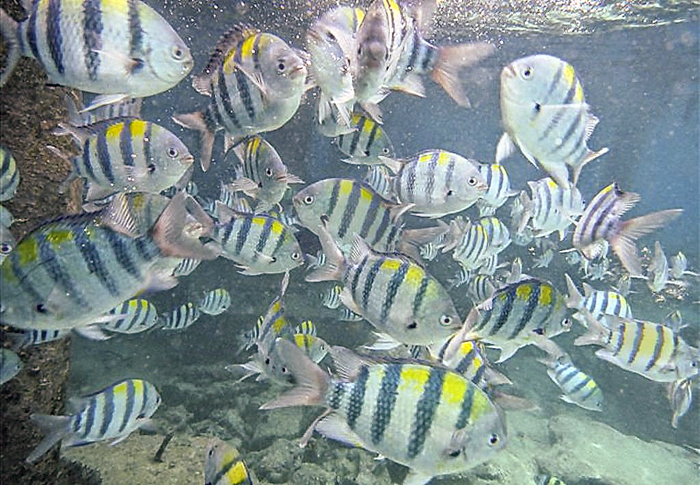
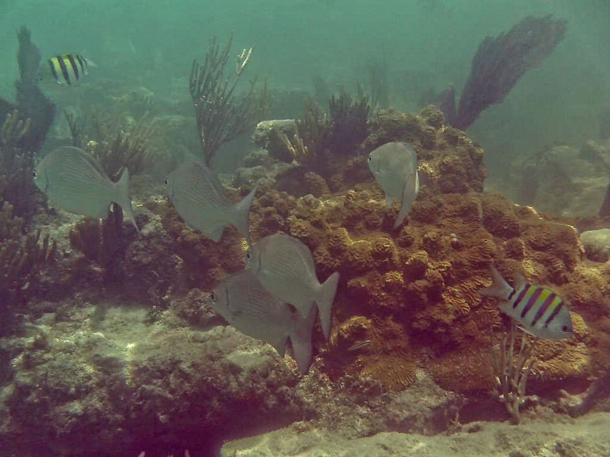
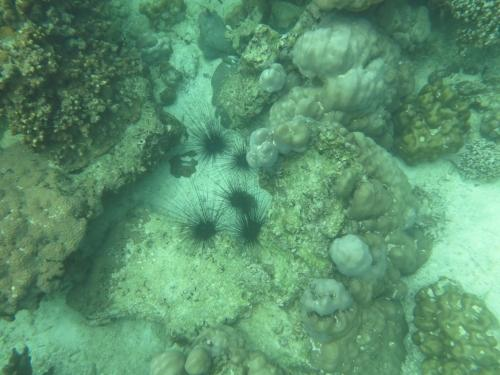

# LACC_LACE
This is an implementation in Python of the enhancement algorithm proposed in this [paper](https://ieeexplore.ieee.org/document/9788535) for underwater images

## Warning
While the referenced paper is rather self-contained, there seems to be some ambiguity, and presumably some notation inconsistency, in several parts of the presented algorithm in the paper. That sometimes makes it challenging to grasp what the authors intended to express, as the paper is not supplemented with algorithm details (like pseudocode). Therefore, this implementation could be less faithful to the original algorithm in those uncertain areas where my interpretation has to be given, and please be cognizant of the potential discrepancies which might end up degrading the supposed performance.

## Prerequisites
1. Python3 environment
2. Numpy
3. OpenCV for Python

It might not be necessary to use the recent/latest version of them, but my test was conducted against python=3.12.3, numpy=1.26.4, and opencv=4.9.0

## Usage
There are two modules corresponding to the two main components of the algorithm: LACC.py for "Locally Adaptive Color Correction" and LACE.py for "Locally Adaptive Contrast Enhancement". Please check [test.py](./test.py) to see the example of how to use them. You could also find parameter definitions of functions in the Python docstrings via
```python
import LACC, LACE
help(LACC)
help(LACE)
```

## Gallery
The raw images below are sourced from the [UIEB dataset](https://li-chongyi.github.io/proj_benchmark.html)
| Input | Output |
| --- | --- |
|  |  |
|  |  |
|  |  |
|  |  |


